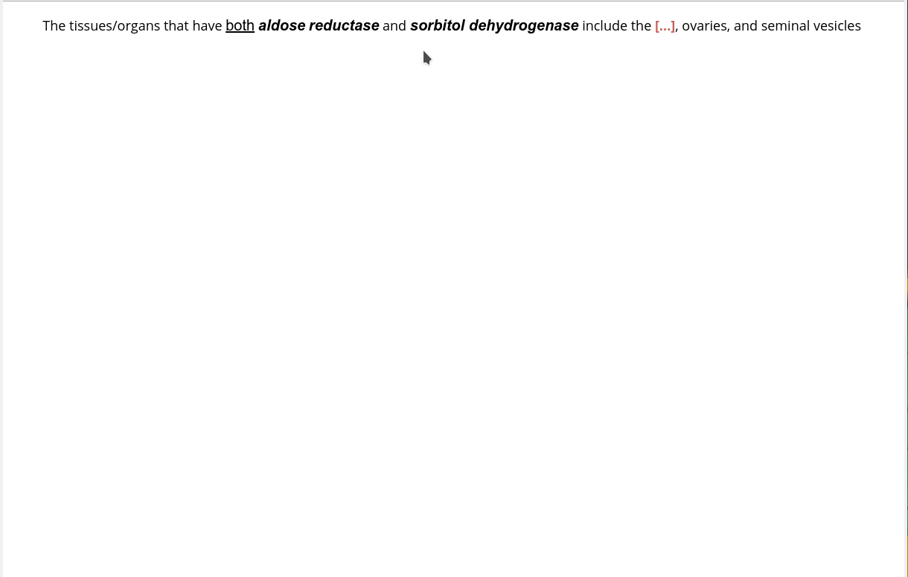

## Popup Dictionary Add-on for Anki <!-- omit in toc -->

This is an add-on for the spaced-repetition flashcard app [Anki](https://apps.ankiweb.net/). It provides the ability to quickly draw up related facts on words or phrases, just by double-clicking on them.

### Table of Contents <!-- omit in toc -->

<!-- MarkdownTOC -->

- [Screenshots](#screenshots)
- [Installation](#installation)
- [Documentation](#documentation)
- [License and Credits](#license-and-credits)

<!-- /MarkdownTOC -->

### Screenshots

### Installation

**AnkiWeb**

Popup dictionary is still in beta, so it's not available on AnkiWeb, yet.

**Manual installation**

*Anki 2.0*

1. Go to *Tools* → *Add-ons* → *Open add-ons folder*
2. Find and delete `Popup Dictionary.py` and `popup_dictionary` if they already exist
3. Download and extract the latest Anki 2.0 add-on release from the [releases tab](https://github.com/glutanimate/popup-dictionary/releases)
4. Move `Popup Dictionary.py` and `popup_dictionary` into the add-ons folder
5. Restart Anki

*Anki 2.1*

1. Go to *Tools* → *Add-ons*
2. Click on an empty area within the add-on list to the left
3. Click on *View Files* to open the add-ons folder (named `addons21`)
4. See if the `popup_dictionary` folder already exists. if so:
    1. Copy the `meta.json` file within to a safe location. This will allow you to preserve your current settings.
    2. Proceed to delete the `popup_dictionary` folder
5. Download and extract the latest Anki 2.1 add-on release from the [releases tab](https://github.com/glutanimate/popup-dictionary/releases)
6. Should the extracted folder not be named `popup_dictionary`: Rename it to `popup_dictionary`
7. Move the extracted `popup_dictionary` folder into your add-ons directory (`addons21`)
8. Optional: Place the `meta.json` file back in the directory if you created a copy beforehand.
9. Restart Anki

### Documentation

For further information on the use of this add-on please check out [the original add-on description](docs/description.md).

### License and Credits

*Popup Dictionary* is *Copyright © 2018-2019 [Aristotelis P.](https://glutanimate.com/)*

My work on the initial version of this add-on was partially funded by two fellow Anki users. I would like to thank both of them for their help.

Ships with the following javascript libraries:

- jQuery (v1.12.4), (c) jQuery Foundation, licensed under the MIT license
- qTip2 (v2.1.1), (c) 2011-2018 Craig Michael Thompson, licensed under the MIT license
- jQuery.highlight, (c) 2007-2014 Johann Burkard, licensed under the MIT license

Popup Dictionary is free and open-source software. The add-on code that runs within Anki is released under the GNU AGPLv3 license, extended by a number of additional terms. For more information please see the [license file](https://github.com/glutanimate/popup-dictionary/blob/master/LICENSE) that accompanied this program.

This program is distributed in the hope that it will be useful, but WITHOUT ANY WARRANTY. Please see the license file for more details.

----

<b>

The development of this add-on was made possible thanks to my <a href="https://www.patreon.com/glutanimate">Patreon</a> and <a href="https://ko-fi.com/X8X0L4YV">Ko-Fi</a> supporters.

Thank you so much for your love and support ❤️ !

</b>
